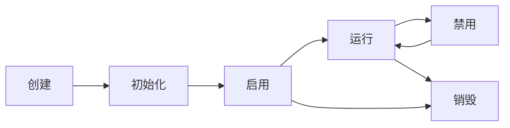

# 组件系统详解

Rings Engine 采用组件-实体系统(ECS)架构，通过组件组合实现复杂的3D对象功能。

## 🧩 组件架构概览

### 组件类型分类

| 组件类别 | 核心组件 | 功能描述 |
|----------|----------|----------|
| **渲染组件** | MeshRenderer | 网格渲染 |
|           | SkinnedMeshRenderer | 骨骼动画渲染 |
|           | ParticleRenderer | 粒子系统 |
| **光照组件** | DirectionalLight | 方向光 |
|           | PointLight | 点光源 |
|           | SpotLight | 聚光灯 |
| **变换组件** | Transform | 空间变换 |
| **相机组件** | Camera3D | 相机投影 |
| **物理组件** | Rigidbody | 刚体物理 |
|           | Collider | 碰撞体 |

## 🎯 核心组件详解

### 1. Transform组件

**Transform** 是所有3D对象的基础组件，负责空间变换和层级管理。

#### 核心属性：
- **localPosition**: 本地空间位置
- **localRotation**: 本地空间旋转（四元数）
- **localScale**: 本地空间缩放
- **worldMatrix**: 世界变换矩阵
- **parent**: 父对象引用
- **children**: 子对象列表

#### 变换操作：
```typescript
const transform = obj.getComponent(Transform);

// 设置位置
transform.localPosition = new Vector3(0, 1, 0);

// 设置旋转（欧拉角）
transform.localRotation = Quaternion.fromEulerAngles(0, 90, 0);

// 设置缩放
transform.localScale = new Vector3(2, 2, 2);

// 获取世界空间方向
const forward = transform.forward;
const up = transform.up;
```

#### 层级变换：
```typescript
// 添加子对象
const child = new Object3D();
parent.addChild(child);

// 世界空间转本地空间
const localPos = transform.worldToLocal(worldPos);

// 本地空间转世界空间
const worldPos = transform.localToWorld(localPos);
```

### 2. MeshRenderer组件

**MeshRenderer** 负责网格渲染，连接几何体和材质。

#### 核心属性：
- **geometry**: 几何体数据
- **material**: 材质实例
- **castShadow**: 投射阴影
- **receiveShadow**: 接收阴影
- **layer**: 渲染层级

#### 使用示例：
```typescript
const renderer = obj.addComponent(MeshRenderer);

// 设置几何体
renderer.geometry = new BoxGeometry(1, 1, 1);

// 设置材质
renderer.material = new LitMaterial();

// 配置阴影
renderer.castShadow = true;
renderer.receiveShadow = true;
```

#### 几何体类型：
- **BoxGeometry**: 立方体
- **SphereGeometry**: 球体
- **PlaneGeometry**: 平面
- **CylinderGeometry**: 圆柱体
- **CapsuleGeometry**: 胶囊体
- **CustomGeometry**: 自定义几何体

### 3. 光照组件

#### DirectionalLight
模拟太阳光，支持阴影映射：
```typescript
const lightObj = new Object3D();
const light = lightObj.addComponent(DirectionalLight);

// 设置光照参数
light.lightColor = new Color(1, 1, 1);
light.intensity = 1.0;
light.castShadow = true;

// 设置阴影参数
light.shadowBias = 0.001;
light.shadowRadius = 2.0;
light.shadowResolution = 2048;
```

#### PointLight
点光源，支持距离衰减：
```typescript
const light = obj.addComponent(PointLight);
light.range = 10.0;
light.at = 0.1; // 线性衰减
light.quadratic = 0.01; // 二次方衰减
```

#### SpotLight
聚光灯，支持内外圆锥：
```typescript
const light = obj.addComponent(SpotLight);
light.outerAngle = 30; // 外角
light.innerAngle = 20; // 内角
light.range = 15.0;
```

### 4. Camera3D组件

**Camera3D** 提供多种投影模式和高级渲染特性。

#### 投影模式：
```typescript
const camera = obj.addComponent(Camera3D);

// 透视投影
camera.perspective(60, aspect, 0.1, 1000);

// 正交投影
camera.orthographic(-10, 10, -10, 10, 0.1, 1000);
```

#### 高级特性：
- **后处理效果**：支持Bloom、DOF、色调映射
- **多重渲染目标**：支持G-Buffer渲染
- **动态分辨率**：性能自适应
- **级联阴影**：CSM支持

#### 相机控制：
```typescript
// 轨道控制器
const orbitController = obj.addComponent(OrbitController);
orbitController.target = new Vector3(0, 0, 0);
orbitController.distance = 10;

// 第一人称控制器
const fpsController = obj.addComponent(FPSController);
fpsController.moveSpeed = 5.0;
fpsController.sensitivity = 0.1;
```

## 🎨 材质系统

### 材质类型

#### LitMaterial (PBR材质)
标准基于物理的渲染材质：
```typescript
const material = new LitMaterial();
material.baseColor = new Color(1.0, 0.5, 0.2);
material.metallic = 0.8;
material.roughness = 0.3;
material.normalTexture = normalMap;
material.emissiveTexture = emissiveMap;
```

#### UnLitMaterial (无光照材质)
不受光照影响的材质：
```typescript
const material = new UnLitMaterial();
material.baseColor = new Color(1, 1, 1);
material.baseTexture = diffuseTexture;
```

#### CustomMaterial (自定义材质)
使用自定义着色器的材质：
```typescript
const material = new CustomMaterial();
material.shader = customShader;
material.setTexture('u_diffuse', diffuseTexture);
material.setFloat('u_time', 0.0);
```

### 材质属性

| 属性名 | 类型 | 描述 |
|--------|------|------|
| **baseColor** | Color | 基础颜色 |
| **metallic** | number | 金属度 (0-1) |
| **roughness** | number | 粗糙度 (0-1) |
| **emissive** | Color | 自发光颜色 |
| **normalTexture** | Texture | 法线贴图 |
| **metallicTexture** | Texture | 金属度贴图 |
| **roughnessTexture** | Texture | 粗糙度贴图 |
| **emissiveTexture** | Texture | 自发光贴图 |

## 🔄 组件生命周期

### 生命周期方法

```typescript
class MyComponent extends ComponentBase {
    private speed: number = 1.0;
    
    init() {
        // 初始化逻辑
        this.speed = 2.0;
    }
    
    onUpdate(deltaTime: number) {
        // 游戏逻辑更新
    }
    
    onBeforeUpdate(deltaTime: number) {
        // 准备渲染数据
    }
    
    onLateUpdate(deltaTime: number) {
        // 清理或后续处理
    }
    
    onGraphic(view: View3D) {
        // 执行渲染操作
    }
    
    destroy() {
        // 组件销毁
        console.log('组件销毁');
    }
}
```

### 启用/禁用状态

```typescript
const component = obj.getComponent(MyComponent);

// 禁用组件
component.enable = false;

// 启用组件
component.enable = true;

// 监听状态变化
component.addEventListener(ComponentEvent.ENABLED, () => {
    console.log('组件已启用');
});

component.addEventListener(ComponentEvent.DISABLED, () => {
    console.log('组件已禁用');
});
```

## 🧪 自定义组件

### 创建自定义组件

```typescript
import { ComponentBase, RegisterComponent } from '@rings/core';

@RegisterComponent('MyCustomComponent')
export class MyCustomComponent extends ComponentBase {
    private speed: number = 1.0;
    
    init() {
        // 初始化逻辑
        this.speed = 2.0;
    }
    
    onUpdate(deltaTime: number) {
        // 旋转动画
        const transform = this.object3D.getComponent(Transform);
        transform.localRotation = Quaternion.multiply(
            transform.localRotation,
            Quaternion.fromEulerAngles(0, this.speed * deltaTime, 0)
        );
    }
}
```

### 组件通信

#### 事件系统
```typescript
// 发送事件
this.dispatchEvent('customEvent', { data: 'hello' });

// 监听事件
this.addEventListener('customEvent', (event) => {
    console.log(event.data);
});
```

#### 组件查找
```typescript
// 获取同对象的组件
const renderer = this.object3D.getComponent(MeshRenderer);

// 获取子对象的组件
const childComponent = this.object3D.getComponentInChildren(MyComponent);

// 获取父对象的组件
const parentComponent = this.object3D.getComponentInParent(MyComponent);
```

## 📊 性能最佳实践

### 组件优化建议

1. **缓存组件引用**：避免重复查找
```typescript
// 不推荐
onUpdate() {
    const renderer = this.object3D.getComponent(MeshRenderer);
    renderer.material.color = newColor;
}

// 推荐
private renderer: MeshRenderer;
start() {
    this.renderer = this.object3D.getComponent(MeshRenderer);
}
onUpdate() {
    this.renderer.material.color = newColor;
}
```

2. **减少每帧分配**：避免GC压力
```typescript
// 不推荐
onUpdate() {
    const pos = new Vector3(1, 2, 3); // 每帧创建新对象
}

// 推荐
private readonly tempPos = new Vector3();
onUpdate() {
    this.tempPos.set(1, 2, 3); // 复用对象
}
```

3. **合理使用对象池**：
```typescript
// 使用对象池管理临时对象
const pool = new ObjectPool(() => new Vector3());
const vec = pool.get();
// 使用vec...
vec.set(0, 0, 0);
pool.release(vec);
```

## 🔄 生命周期管理

### 完整的生命周期阶段

1. **创建阶段**: 组件实例化
2. **挂载阶段**: 添加到实体并初始化
3. **运行阶段**: 激活/禁用状态切换
4. **销毁阶段**: 资源释放和清理

### 状态转换图



## 🔗 相关资源

- [核心概念 →](/core)
- [着色器开发 →](/shaders)
- [后处理效果 →](/post-processing)
- [API参考 →](/classes/ComponentBase.md)
