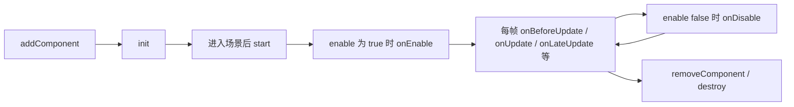

# 组件系统详解

Rings 使用 **实体 + 组件**：**`Object3D`**（继承 **`Entity`**）作为节点，通过 **`addComponent`** 挂载 **`MeshRenderer`**、**`DirectLight`** 等。风格接近 Unity，**不是**纯数据驱动的 ECS。

**相关文档**：[核心概念](./core) · [渲染管线](./rendering) · [自定义组件](./custom-components) · [组件 API 索引（相机/光/纹理/材质等）](./组件系统/README)

---

## 组件分类一览

<table>
<thead><tr><th style="white-space:nowrap">类别</th><th>典型组件</th><th>说明</th></tr></thead>
<tbody>
<tr><td style="white-space:nowrap">变换</td><td><code>Transform</code></td><td>每个 <code>Object3D</code> 构造时自动添加，用 <code>obj.transform</code> 访问</td></tr>
<tr><td style="white-space:nowrap">渲染</td><td><code>MeshRenderer</code>、<code>SkinnedMeshRenderer</code>、<code>PointCloudRenderer</code>、<code>GSplatRenderer</code> 等</td><td>继承 <code>RenderNode</code>，参与管线收集</td></tr>
<tr><td style="white-space:nowrap">灯光</td><td><code>DirectLight</code>、<code>PointLight</code>、<code>SpotLight</code>、<code>GILighting</code> 等</td><td>平行光类名为 <code>DirectLight</code>（不是 DirectionalLight）</td></tr>
<tr><td style="white-space:nowrap">相机</td><td><code>Camera3D</code></td><td>透视 / 正交，可与 <code>HoverCameraController</code>、<code>OrbitController</code> 等配合</td></tr>
<tr><td style="white-space:nowrap">物理</td><td><code>Rigidbody</code>、<code>ColliderComponent</code> 及各种 ColliderShape</td><td>在 <code>@rings/physics</code> 包中，非核心包内置</td></tr>
</tbody>
</table>

> 引擎中 **没有** 名为 `ParticleRenderer`、`CapsuleGeometry`、`CustomGeometry` 的上述表格类；点云 / 高斯泼溅等有专门 Renderer 与 Geometry，见源码 `components/renderer` 与 `shape`。

---

## Transform（变换）

**不要**对同一物体再次 `addComponent(Transform)`（构造里已加）。日常直接用 **`object3D.transform`**，也可用 **`object3D.x / y / z`**、**`rotationY`** 等便捷属性。

**常用能力：**

- **localPosition / localScale**：本地平移、缩放  
- **localRotation**（`Vector3` 欧拉，度）与 **localRotQuat**（四元数）  
- **worldMatrix**：世界矩阵（与 WASM 矩阵缓冲联动）  
- **forward / up / back** 等世界方向  

**旋转示例**（四元数欧拉为 **度**）：

```typescript
import { Object3D, Vector3, Quaternion } from '@rings-webgpu/core';

const obj = new Object3D();
const t = obj.transform;
t.localPosition = new Vector3(0, 1, 0);

const q = new Quaternion();
q.fromEulerAngles(0, 90, 0); // ax, ay, az 单位：度
t.localRotQuat = q;

// 或直接用 Object3D 上的欧拉
obj.rotationY = 45;
```

**父子层级**：**`parent.addChild(child)`**；子节点世界矩阵会受父节点影响。  
**世界 / 本地坐标互转**没有文档化的 `transform.worldToLocal` 便捷 API，请用 **`worldMatrix`** / **`Matrix4`** 等数学工具自行变换，或查阅 `Transform`、`MathUtil`。

---

## MeshRenderer（网格渲染）

连接 **几何体** 与 **材质**，支持阴影与多 Pass 材质。

```typescript
import { Object3D, MeshRenderer, BoxGeometry, LitMaterial } from '@rings-webgpu/core';

const obj = new Object3D();
const renderer = obj.addComponent(MeshRenderer);
renderer.geometry = new BoxGeometry(1, 1, 1);
renderer.material = new LitMaterial();
renderer.castShadow = true;
renderer.receiveShadow = true;
```

**内置几何体（`shape/`）示例**：`BoxGeometry`、`SphereGeometry`、`PlaneGeometry`、`CylinderGeometry`、`TorusGeometry`、`TrailGeometry`、`PointCloudGeometry`、`GSplatGeometry` 等（**无** `CapsuleGeometry` 命名）。

**层级与遮罩**：渲染排序与 `RenderLayer`、**`RendererMask`** 等相关，不是 Unity 的 `layer = 1000` 队列号；详见 [渲染管线](./rendering)。

---

## 灯光组件

### 命名与阴影

- 平行光：**`DirectLight`**  
- 点光：**`PointLight`**；聚光：**`SpotLight`**  
- 公共属性在 **`LightBase`**：**`lightColor`**、**`intensity`**、**`castShadow`** 等  
- **阴影分辨率、bias** 等多在 **`Engine3D.setting.shadow`**，不是 `light.shadowResolution`

```typescript
import { Object3D, DirectLight, PointLight, SpotLight, Color } from '@rings-webgpu/core';

const sun = new Object3D().addComponent(DirectLight);
sun.lightColor = new Color(1, 1, 1, 1);
sun.intensity = 1.2;
sun.castShadow = true;

const point = new Object3D().addComponent(PointLight);
point.range = 10;
point.at = 0.1;
point.quadratic = 0.01;

const spot = new Object3D().addComponent(SpotLight);
spot.outerAngle = 45;
spot.range = 15;
```

---

## Camera3D 与控制器

```typescript
import { Object3D, Camera3D } from '@rings-webgpu/core';

const camObj = new Object3D();
const camera = camObj.addComponent(Camera3D);
camera.perspective(60, aspect, 0.1, 1000);
// camera.orthographic(left, right, top, bottom, near, far);

// 轨道控制器（存在 OrbitController，非仅 Hover）
import { OrbitController } from '@rings-webgpu/core';
const orbit = camObj.addComponent(OrbitController);
orbit.target = new Vector3(0, 0, 0);

// 第一人称：FirstPersonCameraController，需设置 focus 等，见核心概念 / 快速入门
```

后处理、GBuffer、动态分辨率等由 **`Engine3D.setting`** 与 **`PostProcessingComponent`** 等配合实现，**不是** `Camera3D` 上一组独立「开关属性」的简略列表。

---

## 材质（与组件文档相关的部分）

| 类型 | 说明 |
|------|------|
| **LitMaterial** | PBR，贴图槽为 **baseMap / normalMap / maskMap** 等，**不是** baseTexture |
| **UnLitMaterial** | **baseMap**、**baseColor**（`Color`，注意 **RGBA**） |
| **扩展** | 更多材质见 `materials/`；自定义一般继承 **`Material`** 并指定 **`Shader`** |

```typescript
import { LitMaterial, UnLitMaterial, Color } from '@rings-webgpu/core';

const lit = new LitMaterial();
lit.baseColor = new Color(1, 0.5, 0.2, 1);
lit.metallic = 0.8;
lit.roughness = 0.3;
lit.normalMap = normalTex;

const unlit = new UnLitMaterial();
unlit.baseColor = new Color(1, 1, 1, 1);
unlit.baseMap = diffuseTex;
```

**没有**引擎内置类名 **`CustomMaterial`**；自定义材质请扩展 **`Material` + `Shader`**（见 [Shader 开发](./shaders)）。

---

## 组件生命周期（ComponentBase）

回调签名以源码为准：**`onUpdate` / `onLateUpdate` / `onBeforeUpdate` / `onGraphic` / `onCompute`** 的参数是 **`view?: View3D`**（以及 `onCompute` 可选 **`GPUCommandEncoder`**），**没有** 内置的 **`deltaTime` 参数**——需要帧间隔请自行用 **`Time`** 或 `performance.now()`。

```typescript
import { ComponentBase, View3D } from '@rings-webgpu/core';

export class RotateY extends ComponentBase {
  public speed = 60; // 度/秒，示例

  init() {
    // addComponent 后立即调用，仅一次
  }

  start() {
    // 进入场景、具备 scene 后调用一次
  }

  onUpdate?(view?: View3D) {
    this.object3D.rotationY += this.speed * (1 / 60); // 示例：固定步长，生产请接 Time
  }

  onLateUpdate?(view?: View3D) {}
  onBeforeUpdate?(view?: View3D) {}
  onGraphic?(view?: View3D) {}
  onCompute?(view?: View3D, command?: GPUCommandEncoder) {}

  destroy(force?: boolean) {
    super.destroy(force);
  }
}
```

**启用 / 禁用**：**`component.enable = false`** 会触发 **`onDisable`**；**无** 文档化的 **`ComponentEvent.ENABLED`** 常量，勿照搬旧教程代码。

**销毁**：移除组件用 **`object3D.removeComponent(Class)`**；组件内可重写 **`beforeDestroy` / `destroy`**（见 **`ComponentBase`**）。

---

## 自定义组件注册（可选）

若需要被序列化/编辑器按名查找，可使用与内置组件相同的装饰器（**类 + 字符串名**）：

```typescript
import { ComponentBase, RegisterComponent } from '@rings-webgpu/core';

@RegisterComponent(RotateY, 'RotateY')
export class RotateY extends ComponentBase {
  // ...
}
```

（在仓库内开发时 import 路径可能是 `@rings/core` 指向 `src`，发布包用 **`@rings-webgpu/core`**。）

---

## 组件间通信与查找

**事件**：**`ComponentBase`** 继承链上的 **`eventDispatcher`**，或使用 **`CEvent`**：

```typescript
import { CEvent } from '@rings-webgpu/core';

this.eventDispatcher.dispatchEvent(new CEvent('myType', { msg: 'hello' }));
this.eventDispatcher.addEventListener('myType', (e: CEvent) => {
  console.log(e.data);
}, this);
```

**查找组件**：

- 同一物体：**`this.object3D.getComponent(MeshRenderer)`**  
- 子树：**`getComponentsInChild(MeshRenderer)`** 返回 **数组**（注意方法名是 **InChild**，不是 `getComponentInChildren`）  
- 父链：**`getComponentFromParent(SomeComponent)`**（不是 `getComponentInParent`）

---

## 性能建议（避免伪 API）

1. **缓存引用**：在 **`start`** 里 **`getComponent`** 一次，不要在 **`onUpdate` 里每帧查找**。  
2. **少分配**：`Vector3` 有 **`set(x,y,z,w)`**，可复用成员变量代替每帧 `new Vector3()`。  
3. **对象池**：引擎提供 **`PoolNode`**（`core/pool/ObjectPool.ts`），API 为 **`getOne(构造函数)`** / **`pushBack`**，与网上常见的 `pool.get()`/`release()` 不同，使用前请读源码。

```typescript
// 不推荐：每帧 new
onUpdate() {
  const v = new Vector3(1, 2, 3);
}

// 推荐：复用
private _tmp = new Vector3();
onUpdate() {
  this._tmp.set(1, 2, 3);
}
```

更系统的优化见 [性能与调优](./performance)。

---

## 生命周期示意图（概念）


```mermaid
graph LR
  A[addComponent] --> B[init]
  B --> C[进入场景后 start]
  C --> D[enable 为 true 时 onEnable]
  D --> E[每帧 onBeforeUpdate / onUpdate / onLateUpdate 等]
  E --> F[enable false 时 onDisable]
  F --> E
  E --> G[removeComponent / destroy]
```

---

## 🔗 相关资源

- [核心概念](./core)
- [自定义组件](./custom-components)
- [渲染管线](./rendering)
- [性能与调优](./performance)
- [ComponentBase API](classes/ComponentBase.md)
