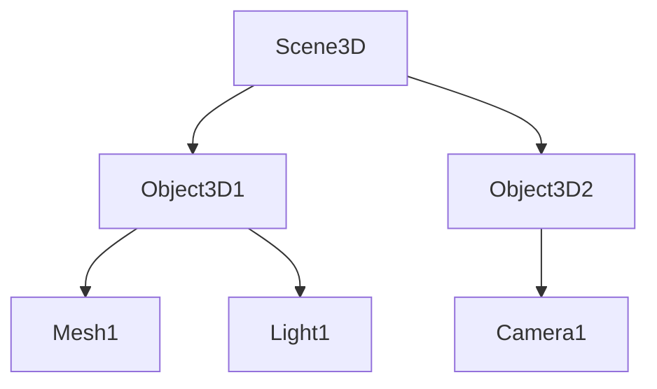

# 核心概念

## 引擎架构

Rings 框架采用分层架构设计：

1. **核心层**：提供基础渲染能力
2. **组件层**：实现各种功能组件
3. **应用层**：提供高级 API 和工具

## 场景图系统

Rings 使用树状场景图管理所有 3D 对象：



## 渲染管线

Rings 的渲染流程：

```
Rings渲染流程图:
+----------------+     +----------------+     +----------------+     +----------------+
|  场景遍历      |---->| 可见性剔除     |---->| 材质准备       |---->| 绘制调用       |
+----------------+     +----------------+     +----------------+     +----------------+
                                                                    |
                                                                    v
                                                    +----------------+     +----------------+
                                                    | 后处理         |---->| 帧结束         |
                                                    +----------------+     +----------------+
                                                          ^
                                                          |
                                                    +----------------+
                                                    | 还有对象?      |
                                                    +----------------+
                                                          |
                                                          +--[是]-->回到场景遍历
```

详细步骤：

1. 场景遍历
2. 可见性剔除
3. 材质准备
4. 绘制调用
5. 后处理

## 关键组件

- `Engine3D`：引擎核心
- `Scene3D`：场景容器
- `Object3D`：3D 对象基类
- `Camera3D`：相机组件
- `MeshRenderer`：网格渲染器

[了解更多组件系统 →](/components)
