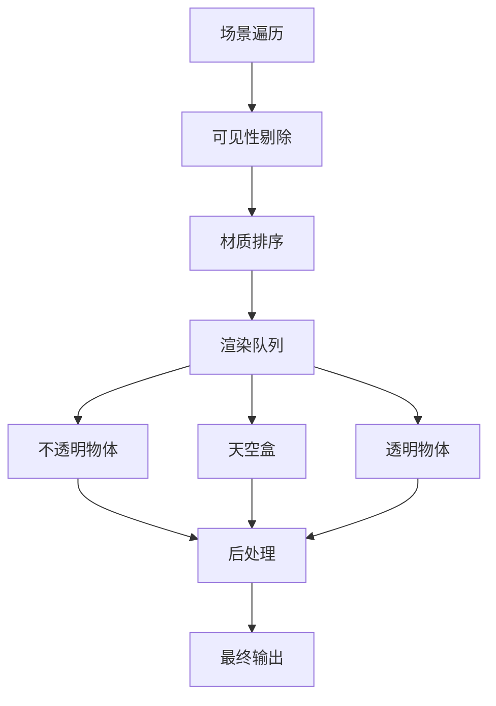

# 核心概念

Rings Engine 基于现代WebGPU技术构建，采用组件-实体系统(ECS)架构，提供高性能的3D渲染解决方案。

## 🏗️ 系统架构

### 三层架构设计

```
┌─────────────────────────────────────────────────────────┐
│                    应用层 (Application Layer)              │
│  • 高级API封装      • 场景管理      • 资源管理               │
├─────────────────────────────────────────────────────────┤
│                    组件层 (Component Layer)                │
│  • 渲染组件        • 光照组件      • 变换组件                │
│  • 物理组件        • 动画组件      • UI组件                  │
├─────────────────────────────────────────────────────────┤
│                    核心层 (Core Layer)                     │
│  • WebGPU上下文    • 渲染管线      • 数学库                  │
│  • 资源系统        • 事件系统      • 工具类                 │
└─────────────────────────────────────────────────────────┘
```

## 🎯 核心概念

### 1. 引擎核心 (Engine3D)

**Engine3D** 是单例模式的引擎入口，负责整个渲染系统的生命周期管理。

#### 主要职责：
- WebGPU设备初始化和上下文管理
- 渲染循环调度和时间管理
- 全局资源管理和缓存
- 输入系统和事件分发
- 性能监控和调试支持

#### 生命周期：
```typescript
// 引擎初始化
await Engine3D.init();

// 创建渲染视图
const view = new View3D();
view.scene = scene;
view.camera = camera;

// 启动渲染循环
Engine3D.startRenderView(view);
```

### 2. 场景管理 (Scene3D)

**Scene3D** 是场景图的根节点，负责管理整个3D场景的环境和层级结构。

#### 核心功能：
- 环境光照设置（环境贴图、曝光度）
- 天空盒和背景管理
- 全局雾效和大气渲染
- 场景层级管理
- 动态加载和卸载

#### 环境配置：
```typescript
const scene = new Scene3D();
scene.envMap = await Engine3D.res.loadTexture('env.hdr');
scene.exposure = 1.2;
scene.roughness = 0.5;
```

### 3. 视图系统 (View3D)

**View3D** 定义了渲染的视口和输出目标，连接场景、相机和渲染表面。

#### 核心属性：
- **scene**: 关联的场景实例
- **camera**: 渲染使用的相机
- **canvas**: 渲染目标画布
- **renderTarget**: 离屏渲染目标

### 4. 相机系统 (Camera3D)

**Camera3D** 提供透视和正交投影，支持多种相机控制模式。

#### 投影类型：
- **透视投影**：模拟人眼视觉，适用于3D场景
- **正交投影**：无透视变形，适用于2D/UI渲染

#### 高级特性：
- 级联阴影映射(CSM)支持
- 视锥体剔除优化
- 动态分辨率缩放
- 多相机渲染分层

```typescript
import { Object3D, Camera3D } from '@rings/core';

const camera = new Object3D();
const camera3D = camera.addComponent(Camera3D);
camera3D.perspective(60, aspect, 0.1, 1000);
camera3D.enableCSM = true;
```

### 5. 实体系统 (Object3D)

**Object3D** 是所有3D对象的基类，采用组件化设计，支持灵活的扩展。

#### 核心特性：
- **层级变换**：支持父子关系和相对变换
- **组件系统**：动态添加/移除功能组件
- **事件系统**：变换和生命周期事件
- **对象池**：内存优化和复用

#### 组件架构：
```typescript
import { Object3D, Transform, MeshRenderer, BoxGeometry, LitMaterial, Vector3 } from '@rings/core';

const obj = new Object3D();

// 添加变换组件
const transform = obj.addComponent(Transform);
transform.localPosition = new Vector3(0, 1, 0);

// 添加渲染组件
const renderer = obj.addComponent(MeshRenderer);
renderer.geometry = new BoxGeometry();
renderer.material = new LitMaterial();

// 添加到场景
scene.addChild(obj);
```

## 🔄 渲染管线

### 前向渲染管线

Rings Engine 采用优化的前向渲染架构，支持现代GPU特性：



#### 渲染阶段：

1. **预深度渲染**：生成深度缓冲，优化后续渲染
2. **主渲染通道**：处理不透明和透明物体
3. **天空盒渲染**：环境背景和反射
4. **后处理效果**：抗锯齿、色调映射、Bloom等

### 多光源支持

#### 光源类型：
- **方向光(DirectionalLight)**：模拟太阳光，支持阴影
- **点光源(PointLight)**：全向光源，支持衰减
- **聚光灯(SpotLight)**：锥形光束，支持内外角
- **区域光(AreaLight)**：矩形/圆形面光源

#### 光照特性：
- **实时阴影**：PCF软阴影、CSM级联阴影
- **全局光照**：DDGI探针系统
- **反射探针**：环境反射和镜面反射
- **光照剔除**：基于瓦片的延迟光照

## 🎨 材质系统

### PBR材质工作流

基于物理的渲染(PBR)材质系统，支持金属度/粗糙度工作流：

#### 材质属性：
- **Base Color**：表面基础颜色
- **Metallic**：金属度 (0-1)
- **Roughness**：粗糙度 (0-1)
- **Normal Map**：法线贴图
- **Emissive**：自发光颜色
- **AO Map**：环境光遮蔽

#### 材质类型：
- **LitMaterial**：标准PBR材质
- **UnLitMaterial**：无光照材质
- **CustomMaterial**：自定义着色器

```typescript
const material = new LitMaterial();
material.baseColor = new Color(1.0, 0.5, 0.2);
material.metallic = 0.8;
material.roughness = 0.3;
material.normalTexture = normalMap;
```

## 🗂️ 资源管理

### 资源加载系统

**Res** 类提供统一的资源管理和加载接口：

#### 支持的格式：
- **3D模型**：GLTF、GLB、OBJ、FBX
- **纹理**：PNG、JPG、HDR、KTX2
- **音频**：MP3、WAV、OGG
- **字体**：TTF、OTF、FNT

#### 加载示例：
```typescript
// 加载3D模型
const model = await Engine3D.res.loadGltf('model.gltf');
scene.addChild(model);

// 加载纹理
const texture = await Engine3D.res.loadTexture('diffuse.png');
material.baseTexture = texture;

// 加载HDR环境贴图
const env = await Engine3D.res.loadTexture('env.hdr', { type: 'hdr' });
scene.envMap = env;
```

### 资源缓存策略

- **LRU缓存**：基于使用频率的自动清理
- **压缩纹理**：BCn格式减少内存占用
- **异步加载**：支持并发加载和进度回调
- **对象池**：几何体和材质复用

## 📊 性能优化

### GPU优化技术

| 优化技术 | 实现方式 | 性能提升 |
|----------|----------|----------|
| **实例化渲染** | GPU Instancing | 10x+ 对象数量 |
| **遮挡剔除** | 层级Z-Buffer | 50%+ 绘制调用减少 |
| **材质合并** | 动态合批 | 30%+ CPU开销降低 |
| **纹理压缩** | BCn格式 | 75% 内存占用减少 |
| **着色器缓存** | 预编译管线 | 90% 编译时间减少 |

### 内存管理

- **对象池化**：减少GC压力
- **纹理流送**：按需加载高分辨率纹理
- **几何体LOD**：基于距离的模型简化
- **光照剔除**：视锥体和距离剔除

## 🎯 最佳实践

### 场景构建建议

1. **层级结构**：合理使用父子关系管理变换
2. **组件组合**：按需添加功能组件，避免过度设计
3. **资源优化**：使用压缩纹理和简化几何体
4. **光照设置**：平衡质量和性能的光照配置

### 性能监控

```typescript
// 启用性能统计
Engine3D.stats.showStats = true;

// 监控渲染信息
Engine3D.stats.onUpdate = (stats) => {
    console.log(`FPS: ${stats.fps}`);
    console.log(`Draw Calls: ${stats.drawCalls}`);
    console.log(`Triangles: ${stats.triangles}`);
};
```

## 🔗 相关资源

- [组件系统详解 →](/components)
- [着色器开发指南 →](/shaders)
- [后处理效果 →](/post-processing)
- [API参考文档 →](/classes/Engine3D.md)
