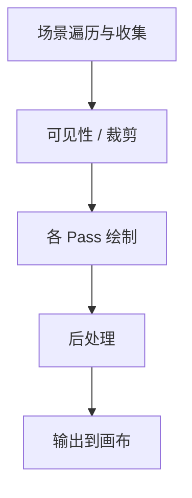

# 核心概念

Rings Engine 基于 WebGPU，采用 **实体 + 组件** 的对象模型（`Object3D` / `Entity` 挂载 `MeshRenderer`、`DirectLight` 等组件，风格接近 Unity 式场景图；并非纯数据驱动的 ECS）。

## 🏗️ 系统架构

### 分层说明（与源码目录对应）

```
┌─────────────────────────────────────────────────────────┐
│  应用层：业务逻辑，调用 Engine3D / Scene3D / View3D / Res   │
├─────────────────────────────────────────────────────────┤
│  场景与组件：Object3D、Scene3D、Camera3D、View3D、各类       │
│  Component（渲染、灯光、动画、GUI、后处理等）               │
├─────────────────────────────────────────────────────────┤
│  渲染与图形：gfx/graphics/webGpu（设备、Buffer、Shader）     │
│  + gfx/renderJob（ForwardRenderJob、各 Pass、资源表）       │
│  + loader / materials / textures                           │
└─────────────────────────────────────────────────────────┘
```

物理（`@rings/physics`）、统计面板（`@rings/stats`）、音视频材质（`@rings/media-extention`）等为 **独立子包**，按需接入。

---

## 🎯 核心对象与职责

### 1. 引擎入口 (Engine3D)

**Engine3D** 以 **静态成员** 提供初始化与主循环，不负责「场景树」本身。

- **WebGPU**：全局 `webGPUContext`（设备、画布、尺寸更新）。
- **主循环**：`startRenderView` / `startRenderViews`、`pause`、`resume`；可选 `beforeRender` / `renderLoop` / `lateRender`。
- **全局单例式服务**：`Engine3D.res`、`Engine3D.inputSystem`。
- **全局配置**：`Engine3D.setting`（渲染、阴影、后处理、拾取、加载并发等）。

#### `Engine3D.setting` 与「场景属性」的边界

| 放在 `Engine3D.setting` | 放在 `Scene3D` / 组件 |
|---------------------------|------------------------|
| 阴影贴图尺寸、全局 shadowBias、拾取 mode | `envMap`、`exposure`、`roughness`（与天空联动） |
| 后处理总开关与各子项默认参数 | `AtmosphericComponent`、雾、大气等 |
| `loader.numConcurrent`、渲染 debug 等 | 具体物体的 `MeshRenderer`、`ColliderComponent` 等 |

#### 生命周期（单视图）

```typescript
import { Engine3D, View3D } from '@rings-webgpu/core';

await Engine3D.init({
  canvasConfig: { canvas: document.getElementById('canvas') as HTMLCanvasElement },
});

const view = new View3D();
view.scene = scene;
view.camera = camera;

Engine3D.startRenderView(view);
```

#### 多视图

每个 `View3D` 对应一条 **`ForwardRenderJob`**（存在 `Engine3D.renderJobs` 的 Map 中）。多视口或多相机分屏时使用：

```typescript
Engine3D.startRenderViews([viewA, viewB]);
// Engine3D.getRenderJob(viewA) 可取得对应 RendererJob
```

多视图会增加每帧绘制与收集成本，调优见 [性能与调优](./performance)。

---

### 2. 场景 (Scene3D)

**Scene3D** 继承 `Object3D`，作为场景根节点，并持有环境与天空相关状态。

- **envMap**、**exposure**、**roughness**（与 `EntityCollect` 中天空对象联动）。
- 赋值 **`view.scene = scene`** 时会设置 **`scene.view`**，供阴影收集、拾取等使用。
- 雾、大气等多通过 **组件** 或 **`Engine3D.setting`**，而非全部由 `Scene3D` API 承担。

```typescript
const scene = new Scene3D();
const env = await Engine3D.res.loadHDRTextureCube('studio.hdr');
scene.envMap = env;
scene.exposure = 1.2;
scene.roughness = 0.5;
```

---

### 3. 视图 (View3D)

连接 **场景、相机、视口**；**WebGPU 画布**在全局 `webGPUContext`，一般不在 `View3D` 上挂 `canvas` 字段。

- **scene** / **camera**
- **viewPort**（`Vector4`）
- **pickFire**：拾取与 `PICK_*` 事件（需 `enablePick`）
- **canvasList**：GUI 的 `GUICanvas`（`enableUICanvas` 等）

---

### 4. 相机 (Camera3D)

透视 / 正交投影；**CSM** 通过 **`camera3D.enableCSM`** 与 **`Engine3D.setting.shadow`** 等配合。

```typescript
import { Object3D, Camera3D } from '@rings-webgpu/core';

const cameraObj = new Object3D();
const camera3D = cameraObj.addComponent(Camera3D);
camera3D.perspective(60, aspect, 0.1, 1000);
camera3D.enableCSM = true;
```

---

### 5. 实体与变换 (Object3D & Transform)

**Object3D** 构造时会 **自动** `addComponent(Transform)`，通过 **`transform`** 访问本地/世界矩阵；也可使用 **`x` / `y` / `z`** 等便捷属性（与 `transform` 同步）。

- **组件**：`addComponent` / `getComponent` / `removeComponent` / `getOrAddComponent`
- **层级**：`addChild`、`parent`，子节点继承世界变换
- **事件**：实体侧事件派发（与 `CEventDispatcher` 体系一致）

```typescript
import { Object3D, MeshRenderer, BoxGeometry, LitMaterial, Vector3 } from '@rings-webgpu/core';

const obj = new Object3D();
obj.transform.localPosition = new Vector3(0, 1, 0);
// 或 obj.y = 1;

const renderer = obj.addComponent(MeshRenderer);
renderer.geometry = new BoxGeometry(1, 1, 1);
renderer.material = new LitMaterial();

scene.addChild(obj);
```

---

### 6. 组件生命周期 (ComponentBase)

业务自定义组件应继承 **`ComponentBase`**（或实现 `IComponent` 约定），典型顺序为：

1. **`init(param?)`**：`addComponent` 时调用，适合做一次性配置。
2. **`start()`**：进入场景、具备 `scene3D` / `view3D` 后触发一次。
3. **`onUpdate` / `onLateUpdate` / `onBeforeUpdate` 等**：注册后在引擎循环中调用（若存在）。
4. **`onEnable` / `onDisable`**：与 `component.enable` 切换相关。
5. **`destroy`**：移除组件与解绑。

渲染类组件（如 **`MeshRenderer`**）继承 **`RenderNode`**，仍遵循上述基类约定；被收集进各 **Pass** 绘制。

---

### 7. 输入与事件

- **全局指针/键盘**：**`Engine3D.inputSystem`**，监听 **`PointerEvent3D.POINTER_*`** 等（见 `event` 模块）。
- **拾取**：**`view.pickFire`** 在 **`Engine3D.setting.pick.enable`** 时向 `inputSystem` 注册；拾取结果通过 **`PointerEvent3D.PICK_CLICK`** 等派发，`event.target` 为命中 **`Object3D`**。
- **拾取模式**：**`Engine3D.setting.pick.mode`** 为 **`bound`**（包围体 + 射线）或 **`pixel`**（GPU 拾取）；**bound** 模式下物体通常需要 **`ColliderComponent`** 参与。

---

### 8. 材质、Shader 与纹理槽位

- **`Material`** 持有 **`Shader`**（多 Pass：`RenderShaderPass`），uniform 与纹理槽位由 Shader 定义。
- **`ShaderLib.init()`** 等在 **`Engine3D.init`** 中完成，内置 WGSL/着色器模块注册到库中。
- **`LitMaterial`** 等封装常用 PBR：**`baseColor` / `metallic` / `roughness`** 与贴图槽 **`baseMap` / `normalMap` / `maskMap`** 等（不是 `baseTexture`）。

完整 uniform 与扩展材质见 [LitMaterial API](api/materials/LitMaterial.md) 与 [Shader 开发](./shaders)。

```typescript
import { LitMaterial, Color } from '@rings-webgpu/core';

const material = new LitMaterial();
material.baseColor = new Color(1, 0.5, 0.2, 1);
material.metallic = 0.8;
material.roughness = 0.3;
material.normalMap = normalMap;
```

---

### 9. 数学与矩阵

常用 **`Vector3` / `Vector4` / `Matrix4` / `Quaternion` / `Color`**。部分矩阵运算与缓冲布局依赖 **`@rings/wasm-matrix`**（由引擎初始化 **`WasmMatrix.init`**），业务层通常只需使用公开数学 API。

---

## 🔄 渲染管线概览

引擎以 **`ForwardRenderJob`** 为主调度 **深度预通道、阴影、GBuffer/光照、天空、透明、后处理** 等（具体 Pass 与开关见 [渲染管线](./rendering)）。


```mermaid
graph TD
    A[场景遍历与收集] --> B[可见性 / 裁剪]
    B --> C[各 Pass 绘制]
    C --> D[后处理]
    D --> E[输出到画布]
```

### 光源（核心三类）

- **DirectLight**（平行光）、**PointLight**、**SpotLight**  
阴影、级联、Cluster 与 DDGI、反射探针等 **扩展说明** 见 [渲染管线](./rendering)，此处不展开实现细节。

---

## 🗂️ 资源 (Res)

**`Engine3D.res`** 提供 **`loadGltf`、 `loadTexture`、 `loadHDRTextureCube`** 等；支持 GLTF/GLB/OBJ 及 B3DM、Prefab、PLY、LAS、KMZ 等（与 Loader 一致）。HDR 环境请用 **`loadHDRTextureCube`**，勿对 `.hdr` 误用 **`loadTexture`**。

```typescript
const model = await Engine3D.res.loadGltf('model.gltf');
scene.addChild(model);

const tex = await Engine3D.res.loadTexture('diffuse.png', null, true);
material.baseMap = tex;

scene.envMap = await Engine3D.res.loadHDRTextureCube('env.hdr');
```

**URL 缓存、并发加载、GPU 压缩与大规模流式** 等见 [性能与调优](./performance)。

---

## ✅ 使用原则（精简）

1. **场景层级**：用父子节点表达组合变换，避免过深无意义嵌套。  
2. **组件**：按需挂载，自定义逻辑继承 `ComponentBase` 并理清 `init` / `start` / `onUpdate`。  
3. **性能与资源**：纹理、实例化、多视图等详见 [性能与调优](./performance)。  
4. **监控**：FPS 面板使用 **`@rings/stats`**；渲染调试用 **`Engine3D.setting.render.debug`**（详见 [快速入门](./quick-start)）。

---

## 🔗 相关资源

- [性能与调优 →](./performance)
- [快速入门 →](./quick-start)
- [渲染管线 →](./rendering)
- [组件系统 →](./components)
- [Shader 开发 →](./shaders)
- [后处理效果 →](./post-processing)
- [Engine3D API →](api/core/Engine3D.md)
