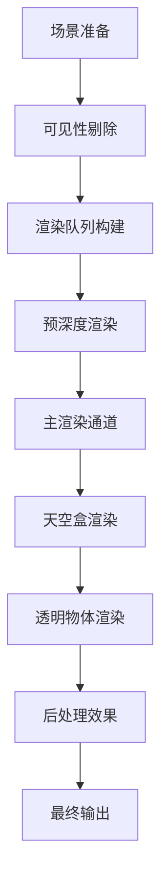

# 渲染管线详解

Rings Engine 基于WebGPU构建现代化渲染管线，支持前向渲染、阴影映射、后处理等高级特性。

## 🎨 渲染架构概览

### 渲染管线流程



### 渲染阶段详解

| 阶段 | 描述 | 优化技术 |
|------|------|----------|
| **预深度** | 生成深度缓冲 | Early-Z剔除 |
| **主渲染** | 不透明物体渲染 | 材质排序 |
| **天空盒** | 环境背景渲染 | 立方体贴图 |
| **透明渲染** | 透明物体渲染 | 深度排序 |
| **后处理** | 全屏效果处理 | 多重采样 |

## 🔍 可见性剔除系统

### 视锥体剔除

基于相机视锥体的几何剔除：

```typescript
// 相机视锥体定义
const frustum = camera.frustum;

// 包围盒测试
const bounds = renderer.bounds;
if (frustum.intersectsBox(bounds)) {
    // 对象可见，加入渲染队列
    renderQueue.add(renderer);
}
```

### 遮挡剔除

使用层级Z-Buffer进行遮挡测试：

```typescript
// CPU端遮挡剔除
const occluders = scene.getOccluders();
for (const renderer of renderers) {
    if (!occlusionCulling.isVisible(renderer)) {
        continue; // 被遮挡，跳过渲染
    }
    renderQueue.add(renderer);
}
```

### 距离剔除

基于距离的LOD系统：

```typescript
const distance = Vector3.distance(cameraPos, objectPos);
const lodLevel = lodSystem.getLODLevel(distance, mesh);

if (lodLevel === -1) {
    // 距离太远，完全剔除
    continue;
}

// 使用对应LOD网格
renderer.geometry = lodMeshes[lodLevel];
```

## 🎯 渲染队列管理

### 队列分类

```typescript
enum RenderQueue {
    Background = 1000,
    Geometry = 2000,
    AlphaTest = 2450,
    Transparent = 3000,
    Overlay = 4000
}
```

### 排序策略

1. **不透明物体**：从前到后排序（Early-Z优化）
2. **透明物体**：从后到前排序（混合正确性）
3. **材质排序**：减少状态切换开销

### 渲染队列构建

```typescript
class RenderQueue {
    private opaqueQueue: RenderBatch[] = [];
    private transparentQueue: RenderBatch[] = [];
    
    addRenderer(renderer: MeshRenderer) {
        const material = renderer.material;
        const isTransparent = material.transparent;
        
        if (isTransparent) {
            this.transparentQueue.push(new RenderBatch(renderer));
        } else {
            this.opaqueQueue.push(new RenderBatch(renderer));
        }
    }
    
    sort() {
        // 不透明物体：从前到后
        this.opaqueQueue.sort((a, b) => {
            return b.depth - a.depth; // 深度降序
        });
        
        // 透明物体：从后到前
        this.transparentQueue.sort((a, b) => {
            return a.depth - b.depth; // 深度升序
        });
    }
}
```

## 💡 光照系统

### 多光源支持

#### 方向光 (DirectionalLight)
模拟太阳光，支持级联阴影映射(CSM)：

```typescript
// 方向光设置
const directionalLight = light.addComponent(DirectionalLight);
directionalLight.intensity = 1.0;
directionalLight.lightColor = new Color(1, 1, 1);
directionalLight.castShadow = true;

// CSM配置
const csm = directionalLight.cascadeShadowMap;
csm.numCascades = 4;
csm.cascadeSplits = [0.1, 0.25, 0.5, 1.0];
```

#### 点光源 (PointLight)
全向光源，支持立方体阴影映射：

```typescript
const pointLight = light.addComponent(PointLight);
pointLight.range = 10.0;
pointLight.at = 0.1;
pointLight.quadratic = 0.01;
pointLight.castShadow = true;

// 阴影映射配置
pointLight.shadowResolution = 1024;
pointLight.shadowBias = 0.005;
```

#### 聚光灯 (SpotLight)
锥形光束，支持投影纹理：

```typescript
const spotLight = light.addComponent(SpotLight);
spotLight.innerAngle = 20;
spotLight.outerAngle = 30;
spotLight.range = 15.0;
spotLight.castShadow = true;

// 投影纹理
spotLight.projectionTexture = goboTexture;
```

### 光照剔除

使用基于瓦片的延迟光照：

```typescript
// 光照剔除着色器
@compute @workgroup_size(8, 8, 1)
fn tileLightCulling(
    @builtin(global_invocation_id) id: vec3<u32>
) {
    let tileIndex = id.x + id.y * tilesX;
    
    // 收集影响该瓦片的光源
    for (var i = 0u; i < numLights; i++) {
        if (lightInTile(i, tileIndex)) {
            lightIndices[tileIndex].push(i);
        }
    }
}
```

## 🌅 阴影渲染

### 阴影映射技术

#### 级联阴影映射 (CSM)

```typescript
class CascadeShadowMap {
    private cascades: ShadowMap[] = [];
    
    update(camera: Camera3D, light: DirectionalLight) {
        for (let i = 0; i < this.numCascades; i++) {
            const split = this.cascadeSplits[i];
            const frustum = camera.getSplitFrustum(split);
            
            // 计算光源投影矩阵
            const lightMatrix = this.calculateLightMatrix(frustum, light.direction);
            
            // 渲染阴影贴图
            this.renderShadowMap(i, lightMatrix);
        }
    }
}
```

#### 软阴影技术

- **PCF (Percentage-Closer Filtering)**
- **PCSS (Percentage-Closer Soft Shadows)**
- **VSM (Variance Shadow Maps)**
- **ESM (Exponential Shadow Maps)**

### 阴影质量优化

```typescript
// 阴影偏差设置
const shadowBias = 0.001;
const shadowNormalBias = 0.005;

// 阴影分辨率
const shadowResolution = 2048; // 或 4096 用于高质量

// 阴影过滤
const shadowFilterSize = 2.0; // PCF滤波大小
```

## 🎭 后处理系统

### 后处理管线

```typescript
class PostProcessingStack {
    private effects: PostProcessEffect[] = [];
    
    addEffect(effect: PostProcessEffect) {
        this.effects.push(effect);
    }
    
    render(source: Texture, destination: Texture) {
        let current = source;
        let temp = this.getTemporaryTexture();
        
        for (const effect of this.effects) {
            effect.render(current, temp);
            [current, temp] = [temp, current]; // 交换
        }
        
        // 最终输出
        this.blit(current, destination);
    }
}
```

### 常用后处理效果

#### 抗锯齿 (FXAA/TAA)

```glsl
// FXAA实现
vec4 fxaa(sampler2D tex, vec2 uv, vec2 texelSize) {
    vec3 rgbNW = texture(tex, uv + texelSize * vec2(-1, -1)).xyz;
    vec3 rgbNE = texture(tex, uv + texelSize * vec2(1, -1)).xyz;
    vec3 rgbSW = texture(tex, uv + texelSize * vec2(-1, 1)).xyz;
    vec3 rgbSE = texture(tex, uv + texelSize * vec2(1, 1)).xyz;
    
    vec3 luma = vec3(0.299, 0.587, 0.114);
    float lumaNW = dot(rgbNW, luma);
    float lumaNE = dot(rgbNE, luma);
    float lumaSW = dot(rgbSW, luma);
    float lumaSE = dot(rgbSE, luma);
    
    // FXAA算法...
    return vec4(result, 1.0);
}
```

#### Bloom效果

```typescript
class BloomEffect extends PostProcessEffect {
    private blurMaterial: Material;
    private combineMaterial: Material;
    
    render(source: Texture, destination: Texture) {
        // 1. 提取亮部
        this.extractHighlights(source, this.brightTexture);
        
        // 2. 多次模糊
        this.gaussianBlur(this.brightTexture, this.blurTexture1);
        this.gaussianBlur(this.blurTexture1, this.blurTexture2);
        
        // 3. 合成最终图像
        this.combineMaterial.setTexture('u_source', source);
        this.combineMaterial.setTexture('u_bloom', this.blurTexture2);
        this.blit(this.combineMaterial, destination);
    }
}
```

#### 色调映射 (Tone Mapping)

```glsl
// ACES色调映射
vec3 aces(vec3 x) {
    const float a = 2.51;
    const float b = 0.03;
    const float c = 2.43;
    const float d = 0.59;
    const float e = 0.14;
    
    return clamp((x * (a * x + b)) / (x * (c * x + d) + e), 0.0, 1.0);
}
```

## 🎮 性能优化

### GPU优化技术

#### 实例化渲染

```typescript
// GPU Instancing
class InstancedRenderer {
    private instanceBuffer: GPUBuffer;
    private instanceCount: number;
    
    render(renderPass: GPURenderPassEncoder) {
        renderPass.setVertexBuffer(1, this.instanceBuffer);
        renderPass.drawIndexed(
            this.indexCount,
            this.instanceCount, // 实例数量
            0, 0, 0
        );
    }
}
```

#### 材质合并

```typescript
// 动态合批
class DynamicBatching {
    private batchGroups: Map<string, RenderBatch[]> = new Map();
    
    addRenderer(renderer: MeshRenderer) {
        const key = this.getBatchKey(renderer);
        if (!this.batchGroups.has(key)) {
            this.batchGroups.set(key, []);
        }
        this.batchGroups.get(key)!.push(renderer);
    }
    
    buildBatches() {
        for (const [key, renderers] of this.batchGroups) {
            if (renderers.length > 1) {
                // 合并网格
                this.mergeMeshes(renderers);
            }
        }
    }
}
```

### 内存管理

#### 资源池化

```typescript
class ResourcePool<T> {
    private pool: T[] = [];
    private createFn: () => T;
    
    constructor(createFn: () => T) {
        this.createFn = createFn;
    }
    
    get(): T {
        return this.pool.pop() || this.createFn();
    }
    
    release(resource: T) {
        this.pool.push(resource);
    }
}
```

#### 纹理流送

```typescript
class TextureStreaming {
    private textureCache: Map<string, Texture> = new Map();
    
    async loadTexture(path: string, priority: number): Promise<Texture> {
        // 检查缓存
        if (this.textureCache.has(path)) {
            return this.textureCache.get(path)!;
        }
        
        // 加载低分辨率版本
        const lowRes = await this.loadLowRes(path);
        
        // 异步加载高分辨率
        this.loadHighResAsync(path, priority);
        
        return lowRes;
    }
}
```

## 📊 调试工具

### 渲染调试

```typescript
// 启用调试模式
Engine3D.debug.enableDebugMode();

// 显示线框
Engine3D.debug.showWireframe = true;

// 显示法线
Engine3D.debug.showNormals = true;

// 显示包围盒
Engine3D.debug.showBounds = true;

// 性能统计
Engine3D.debug.showStats = true;
```

### 性能分析

| 指标 | 理想值 | 优化建议 |
|------|--------|----------|
| **Draw Calls** | < 1000 | 使用实例化/合批 |
| **Triangles** | < 1M | LOD系统 |
| **GPU时间** | < 16ms | 减少overdraw |
| **内存使用** | < 2GB | 纹理压缩 |

## 🔗 相关资源

- [核心概念 →](/core)
- [组件系统 →](/components)
- [着色器开发 →](/shaders)
- [后处理效果 →](/post-processing)
- [API参考 →](/classes/RenderJob.md)