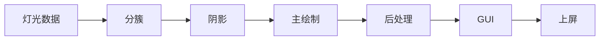

# 渲染管线详解

本篇说明 **每一帧画面是怎么画出来的**：先做哪些准备，再画场景，最后叠后处理和界面。实现上以 **前向渲染** 为主，代码入口在 **`ForwardRenderJob` / `RendererJob`**（`src/gfx/renderJob/jobs/`）。

**延伸阅读**：[核心概念](./core) · [后处理](./post-processing) · [性能与调优](./performance)

---

## 一句话理解

可以把一帧想成一条 **流水线**：先算「哪些灯影响哪些像素」，再画 **阴影贴图**，然后 **画 3D 场景**（含天空、透明物体等），接着做 **全屏后处理**（如泛光、抗锯齿），再画 **2D UI**，最后 **输出到屏幕**。

---

## 一帧里的大致步骤

下面按 **时间顺序** 排列。带「可选」的项由 **`Engine3D.setting`** 里的开关控制，关掉就不会执行。

1. **准备灯光和反射数据**  
   把当前场景里的光源、反射探针等信息更新到 GPU 可用的缓冲里。

2. **（可选）遮挡查询**  
   开启 **`occlusionQuery`** 时，用 GPU 查询判断部分物体是否被挡住，减少无效绘制。

3. **分簇光照（Cluster）**  
   把屏幕划成许多小格子，用计算着色器算出 **每个格子里可能有哪些光源**。主绘制时按格子查表，就能在 **前向渲染** 里支持较多动态光，而不用整套传统延迟渲染。

4. **（可选）画阴影贴图**  
   先为 **平行光**（含级联阴影 CSM）、再为 **点光** 等生成深度贴图，供后面主通道采样。

5. **（可选）深度预通道**  
   开启 **`zPrePass`** 时，先快速写一遍深度，减轻后面主通道的 overdraw。

6. **（可选）DDGI 全局光照**  
   开启 **`gi.enable`** 时，更新并采样辐射度探针等，给场景补间接光。

7. **主绘制**  
   包括 **环境反射**、**颜色主通道** 等：在这里画不透明物体、天空、透明物体等（具体分组在引擎内部完成）。

8. **后处理**  
   对整屏图像做 Bloom、TAA、FXAA 等（由 **`PostProcessingComponent`** 或 **`RendererJob.addPost`** 等挂载的效果类决定）。

9. **GUI**  
   在 3D 之上绘制界面。

10. **呈现到屏幕**  
    把最终颜色交给 WebGPU 的交换链显示。


```mermaid
graph LR
    A[灯光数据] --> B[分簇]
    B --> C[阴影]
    C --> D[主绘制]
    D --> E[后处理]
    E --> F[GUI]
    F --> G[上屏]
```

> **给想读源码的同学**：阴影、分簇、深度预通道等会在 **`RendererJob.renderFrame`** 里按固定顺序调用；和「主 Pass 列表」的遍历是两套逻辑，不必死记类名，知道 **先后顺序** 即可。

---

## 分簇光照是什么？

场景里灯多了，如果每个像素都去算「所有灯」，会很慢。引擎把屏幕分成很多 **簇（Cluster）**，预先算好 **每个簇可能受哪些灯影响**，画像素时只查自己所在簇的灯列表。  
这是 **前向渲染 + 查表** 的做法，和「先画到 GBuffer 再全屏算光」的经典延迟渲染不是同一种结构。

---

## 谁会画在屏幕上？谁会被跳过？

| 问题 | 说明 |
|------|------|
| **哪些物体参与绘制？** | 引擎根据 **相机** 和 **场景** 收集带渲染组件的物体（如 `MeshRenderer`），在内部做视锥相关处理。没有对外暴露类似教程里的 `frustum.intersectsBox` 这种一步 API。 |
| **遮挡** | 使用 **`Engine3D.setting.occlusionQuery`** 时走 **`OcclusionSystem`**；没有 `scene.getOccluders()` 这类通用接口。 |
| **LOD** | 通用「按距离自动换网格 LOD」要自己在业务里做，或看具体 Loader/示例（如大地形、Tiles）。 |

---

## 「渲染层」RenderLayer 是什么？

这里的 **`RenderLayer`** 是 **位标志**（静态批、动态批、隐藏等），用来打标签或批处理，**不是**「Background=1000、Transparent=3000」那种渲染队列编号。  
不透明和透明谁先谁后，由 **颜色主通道内部** 的分组和绘制顺序决定。

---

## 灯光与阴影怎么用？

- **平行光** 的类名是 **`DirectLight`**（不是 DirectionalLight）。  
- **点光** `PointLight`、**聚光灯** `SpotLight`。  
- 颜色、强度、是否投影等：`lightColor`、`intensity`、**`castShadow`** 等（继承自 **`LightBase`**）。

**阴影清晰度、偏移** 等多数在 **`Engine3D.setting.shadow`** 里统一调（例如 `shadowSize`、`pointShadowSize`、`shadowBias`），而不是每个灯光上单独一个 `shadowResolution`。  
平行光的 **级联阴影（CSM）** 用 **`Camera3D.enableCSM`** 配合上述全局阴影设置。

```typescript
import { Object3D, DirectLight, PointLight, SpotLight, Color } from '@rings-webgpu/core';

// 平行光
const sunObj = new Object3D();
const dir = sunObj.addComponent(DirectLight);
dir.lightColor = new Color(1, 1, 1, 1);
dir.intensity = 1.2;
dir.castShadow = true;

// 点光：range 为影响距离，at / quadratic 控制衰减曲线
const pointObj = new Object3D();
const point = pointObj.addComponent(PointLight);
point.range = 10;
point.at = 0.1;
point.quadratic = 0.01;
point.castShadow = true;

// 聚光灯：outerAngle 等为角度（度），详见 SpotLight 注释
const spotObj = new Object3D();
const spot = spotObj.addComponent(SpotLight);
spot.outerAngle = 45;
spot.range = 15;
spot.castShadow = true;
```

---

## 阴影看起来有锯齿或漏光？

优先调 **`Engine3D.setting.shadow`** 里的分辨率、`shadowBias`，以及材质里与 shadow 相关的 uniform（如 `shadowBias`）。具体采样方式在内置 WGSL 里实现，一般不需要自己换一套「PCSS/VSM」命名 API。

---

## 后处理从哪接？

后处理由 **`PostRenderer`** 统一调度，单个效果是 **`PostBase`** 的子类（例如 Bloom、TAA、FXAA）。  
可在 **`PostProcessingComponent`** 里 **`addPost`**，或使用 **`RendererJob.addPost`**。详细列表与用法见 [后处理效果](./post-processing)。

---

## 调试渲染

- 打开 **`Engine3D.setting.render.debug`** 可走引擎内置的渲染调试路径（具体显示内容随版本可能变化）。  
- 核心包 **没有** `Engine3D.debug.showWireframe` 这类字段；FPS 面板请用 **`@rings/stats`**，见 [快速入门](./quick-start) 与 [性能与调优](./performance)。

---

## 🔗 相关文档

- [核心概念](./core) — 引擎、场景、视图、组件  
- [后处理效果](./post-processing) — 各 Post 效果说明  
- [性能与调优](./performance) — 实例化、合批、缓存等  
- [组件系统](./components)  
- [Shader 开发](./shaders)

**源码速查**：`RendererJob.ts`、`ForwardRenderJob.ts`、`ColorPassRenderer.ts`、`ClusterLightingRender.ts`、`PostRenderer.ts`
